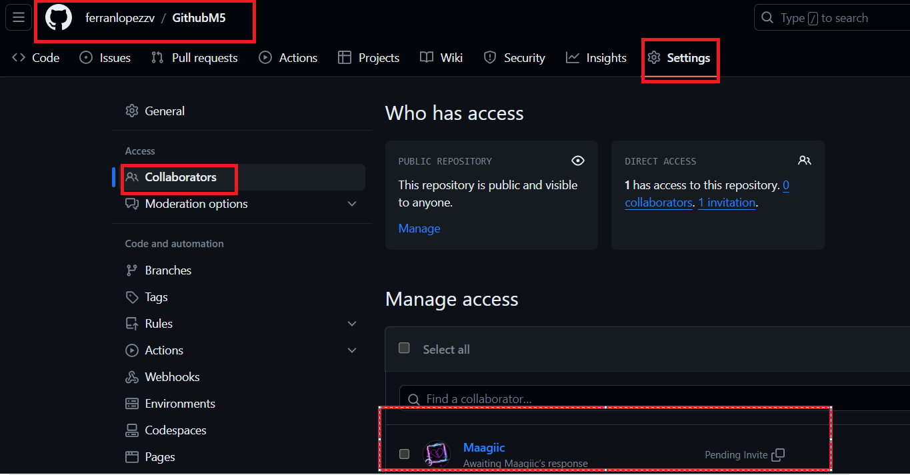
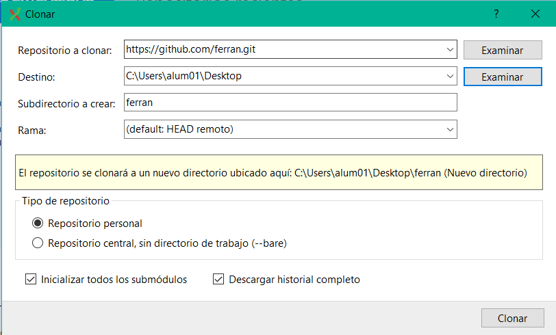

Configuración del repositorio en GitHub:

Accedí a mi cuenta en GitHub y seleccioné el repositorio que quería compartir.
Luego, fui a la pestaña "Settings".
En la sección "Manage access", añadí a mi compañero como colaborador. Esto lo hice ingresando su nombre de usuario o dirección de correo electrónico asociada a su cuenta de GitHub.

Clonar el repositorio localmente con Git Extensions:
Abrí Git Extensions en mi computadora.
Utilicé la opción "Clone repository" o "Clone a repository".
Ingresé la URL del repositorio desde GitHub en el campo correspondiente.
Elegí la ubicación en mi computadora donde quería que se clonara el repositorio.
Finalmente, hice clic en el botón "Clone" para iniciar el proceso de clonación.
Así es como he configurado el repositorio en GitHub para que otro compañero pueda acceder y clonarlo localmente utilizando Git Extensions. Esto permite que podamos trabajar colaborativamente en el proyecto.
